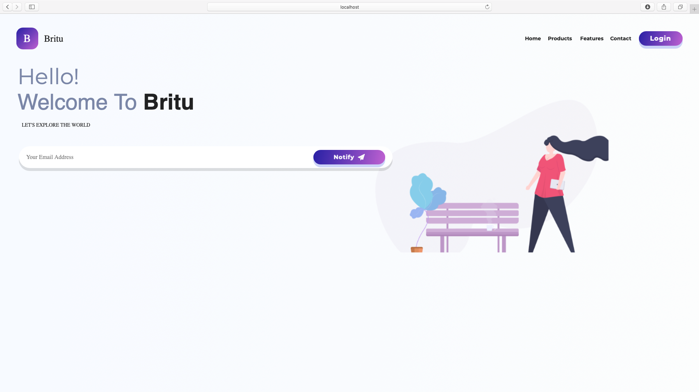

# Responsive Flutter Website

## Screenshots

    

    

## Info

- Guide followed: [Devefy on Youtube](https://www.youtube.com/watch?v=87cz-ihAJ-8&t=68s)
- Original Source Code by Devefy [Via GitHub](https://github.com/devefy/Flutter-Web-Landing-Page)
- Original Inspiration Source [Via Dribbble](https://dribbble.com/shots/4790752-Britu-Landing-Page)
